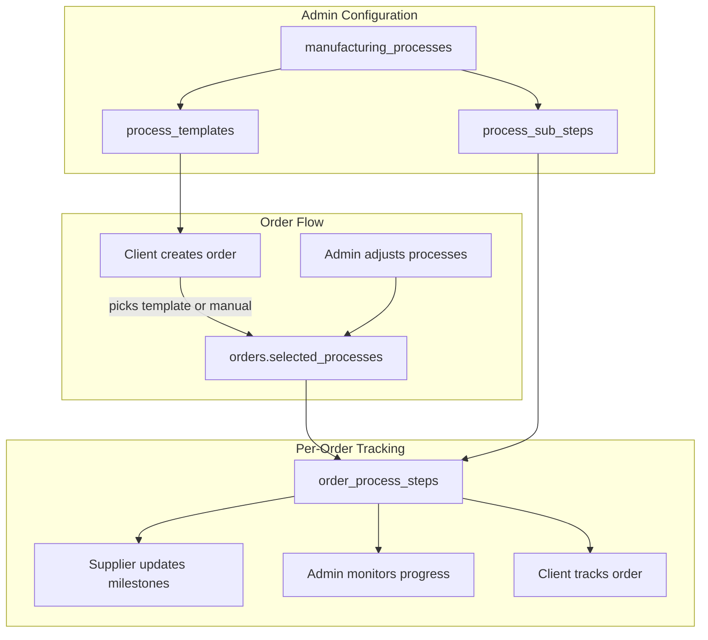

# Manufacturing Process Engine

## Current State

You already have solid foundations:

- `manufacturing_processes` table with admin CRUD ([src/pages/ManufacturingProcessesPage.jsx](src/pages/ManufacturingProcessesPage.jsx))
- Client selects processes at order creation, stored as `orders.selected_processes` JSONB
- `OrderTimeline` dynamically builds stage pipeline from `selected_processes`
- Supplier pipeline built via `buildPipeline()` in [src/pages/SupplierOrderManager.jsx](src/pages/SupplierOrderManager.jsx)

## Architecture Overview




---

## Phase 1: Process Templates

**Goal**: Admin creates reusable process presets (e.g. "Casting Flow", "CNC-Only") that clients can apply during order creation.

### Database

New table `process_templates`:

```sql
CREATE TABLE process_templates (
  id            UUID PRIMARY KEY DEFAULT gen_random_uuid(),
  name          TEXT NOT NULL,
  description   TEXT,
  process_keys  JSONB NOT NULL,  -- ordered array: ["MATERIAL","CASTING","MACHINING"]
  is_default    BOOLEAN DEFAULT FALSE,
  created_by    UUID REFERENCES profiles(id),
  created_at    TIMESTAMPTZ DEFAULT now()
);
```

### UI Changes

- **[src/pages/ManufacturingProcessesPage.jsx](src/pages/ManufacturingProcessesPage.jsx)**: Add a "Templates" tab alongside the existing process list. Admin can create/edit/delete templates by dragging processes into an ordered list and naming it.
- **[src/pages/ClientOrderCreationPage.jsx](src/pages/ClientOrderCreationPage.jsx)**: Step 3 gets a template picker at the top — selecting a template pre-fills the process selection. Client can still manually adjust after picking a template.

### Service Layer

- Add `fetchProcessTemplates()`, `createProcessTemplate()`, `updateProcessTemplate()`, `deleteProcessTemplate()` to [src/services/orderService.js](src/services/orderService.js)

---

## Phase 2: Per-Order Process Customization (Admin Override)

**Goal**: Admin can add, remove, or reorder processes on any order at any time — even after creation.

### Database

No new tables needed. The existing `orders.selected_processes` JSONB column is updated in place.

### UI Changes

- **[src/pages/AdminOrderPreviewPage.jsx](src/pages/AdminOrderPreviewPage.jsx)**: Add an "Edit Processes" button next to the OrderTimeline. Opens a modal/drawer where admin can:
  - Reorder stages via drag-and-drop
  - Add new processes from the `manufacturing_processes` list
  - Remove processes (with confirmation if the order has already passed that stage)
  - Apply a template to overwrite current selection
- **[src/components/OrderTimeline.jsx](src/components/OrderTimeline.jsx)**: Add an `editable` prop. When true, each stage node gets a drag handle and a remove button.

### Service Layer

- Add `updateOrderProcesses(orderId, processKeys[])` to [src/services/orderService.js](src/services/orderService.js)
- Guard: if order has already completed a stage being removed, flag a warning

### Audit

- Log process changes to `activity_logs` (who changed what, when)

---

## Phase 3: Sub-Steps / Checklists

**Goal**: Each manufacturing process can have defined sub-steps (e.g. Machining has "Rough Cut", "Finish Cut", "Deburr"). Progress is tracked per order.

### Database

Two new tables:

```sql
-- Sub-step definitions (admin-managed, linked to a process)
CREATE TABLE process_sub_steps (
  id              UUID PRIMARY KEY DEFAULT gen_random_uuid(),
  process_id      UUID REFERENCES manufacturing_processes(id) ON DELETE CASCADE,
  name            TEXT NOT NULL,
  description     TEXT,
  display_order   INTEGER DEFAULT 0,
  is_required     BOOLEAN DEFAULT TRUE,
  created_at      TIMESTAMPTZ DEFAULT now()
);

-- Per-order sub-step progress
CREATE TABLE order_step_progress (
  id              UUID PRIMARY KEY DEFAULT gen_random_uuid(),
  order_id        UUID REFERENCES orders(id) ON DELETE CASCADE,
  sub_step_id     UUID REFERENCES process_sub_steps(id),
  process_key     TEXT NOT NULL,
  status          TEXT DEFAULT 'pending',  -- pending | in_progress | completed | skipped
  completed_by    UUID REFERENCES profiles(id),
  completed_at    TIMESTAMPTZ,
  notes           TEXT,
  created_at      TIMESTAMPTZ DEFAULT now(),
  UNIQUE(order_id, sub_step_id)
);
```

### UI Changes

- **[src/pages/ManufacturingProcessesPage.jsx](src/pages/ManufacturingProcessesPage.jsx)**: Each process row gets an expandable sub-steps section. Admin can add/edit/delete/reorder sub-steps per process.
- **[src/components/OrderTimeline.jsx](src/components/OrderTimeline.jsx)**: Each stage node becomes expandable — clicking it reveals the sub-step checklist with completion status. Progress bar shows N/M sub-steps complete.
- **Admin Order Preview**: Sub-step progress visible inline. Admin can mark steps complete on behalf of supplier.

### Service Layer

- `fetchSubStepsForProcess(processId)`
- `fetchOrderStepProgress(orderId)`
- `updateStepProgress(orderId, subStepId, status, notes)`
- When an order is created, auto-generate `order_step_progress` rows for all sub-steps of the selected processes

---

## Phase 4: Supplier Milestone Updates

**Goal**: Supplier can update progress within each process stage — check off sub-steps, upload evidence, log dates and notes.

### UI Changes

- **[src/pages/SupplierOrderManager.jsx](src/pages/SupplierOrderManager.jsx)** or **JobDetailsPage**: Add a "Process Progress" section showing the sub-step checklist for each active process stage. Supplier can:
  - Check off sub-steps
  - Add notes per sub-step
  - Upload evidence files (photos, certificates) — stored via Supabase Storage, URL saved in `order_step_progress`
  - See which steps are required vs optional
- **Evidence uploads**: Add `evidence_url TEXT` column to `order_step_progress` (included in Phase 3 schema above). Use existing Supabase storage bucket pattern.

### Notifications

- When supplier completes all required sub-steps for a process stage, auto-notify admin
- When all sub-steps for a stage are complete, suggest stage advancement to admin

### Visibility

- Client sees read-only progress on their order detail/tracking page
- Admin sees full progress with ability to override

---

## Implementation Order

```mermaid
gantt
    title Implementation Phases
    dateFormat X
    axisFormat %s
    section Phase1
    Process Templates           :1, 2
    section Phase2
    Per-Order Admin Override     :2, 3
    section Phase3
    Sub-Steps and Checklists    :3, 5
    section Phase4
    Supplier Milestone Updates  :5, 7
```




**Phase 1** and **Phase 2** are relatively lightweight — mostly UI + a new table. **Phase 3** is the largest (new schema, auto-generation logic, expandable timeline). **Phase 4** builds directly on Phase 3's schema.

## Key Files to Modify


| File                                                                                 | Changes                                                     |
| ------------------------------------------------------------------------------------ | ----------------------------------------------------------- |
| [src/pages/ManufacturingProcessesPage.jsx](src/pages/ManufacturingProcessesPage.jsx) | Add templates tab (P1), sub-steps management (P3)           |
| [src/pages/ClientOrderCreationPage.jsx](src/pages/ClientOrderCreationPage.jsx)       | Template picker in Step 3 (P1)                              |
| [src/pages/AdminOrderPreviewPage.jsx](src/pages/AdminOrderPreviewPage.jsx)           | Edit processes modal (P2), sub-step progress (P3)           |
| [src/components/OrderTimeline.jsx](src/components/OrderTimeline.jsx)                 | Editable mode (P2), expandable sub-steps (P3)               |
| [src/services/orderService.js](src/services/orderService.js)                         | Template CRUD (P1), process update (P2), sub-step CRUD (P3) |
| [src/pages/SupplierOrderManager.jsx](src/pages/SupplierOrderManager.jsx)             | Milestone updates UI (P4)                                   |
| New migration files                                                                  | One per phase                                               |


