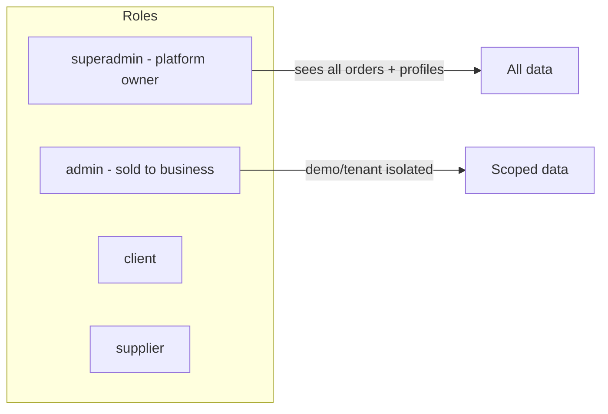

# Superadmin (Platform Owner) Plan

**Goal:** Add a role above `admin` so you can sell **admin** to businesses while retaining full platform control. Superadmin sees all data (no demo/tenant isolation); admin remains demo- or tenant-scoped.

## Role hierarchy

---

## 1. Database (new migration)

- **Add role value:** If `profiles.role` uses Postgres enum `user_role` (see [scripts/seed-demo-users.sql](scripts/seed-demo-users.sql)), add in a new migration: `ALTER TYPE user_role ADD VALUE 'superadmin';`. If `role` is plain TEXT, no schema change.
- **RLS – orders:** Keep existing admin policies in [supabase/migrations/20260309_demo_isolation.sql](supabase/migrations/20260309_demo_isolation.sql). Add new policies for superadmin: `SELECT` and `UPDATE` on `orders` with no demo filter (superadmin sees all orders).
- **RLS – profiles:** Keep existing admin policy. Add policy for superadmin: `SELECT` on `profiles` with no demo filter (superadmin sees all users).
- **RLS – manufacturing_processes:** In [supabase/migrations/20260308_manufacturing_processes.sql](supabase/migrations/20260308_manufacturing_processes.sql) the "Admin full access" policy uses `role = 'admin'`. Either add a new migration that drops and recreates that policy, or add a separate superadmin policy; ensure condition allows `auth_user_role() IN ('admin','superadmin')`.
- **Optional helper:** Add function e.g. `auth_user_is_platform_admin()` returning true when `auth_user_role() IN ('admin','superadmin')` for reuse in policies.

---

## 2. Edge Functions

- **admin-set-password** ([supabase/functions/admin-set-password/index.ts](supabase/functions/admin-set-password/index.ts)): Currently checks `profile?.role !== 'admin'`. Change to allow `admin` or `superadmin` (e.g. `!['admin','superadmin'].includes(profile?.role)` for 403).
- **invite-user** ([supabase/functions/invite-user/index.ts](supabase/functions/invite-user/index.ts)): Reject requests where `role === 'superadmin'` (return 400 with clear message). Superadmins are created only manually (Dashboard or SQL), not via app invite.

---

## 3. App – access control

- **ProtectedRoute** ([src/components/ProtectedRoute.jsx](src/components/ProtectedRoute.jsx)): When `requiredRole === 'admin'`, grant access if `userRole === 'admin' || userRole === 'superadmin'`. Adjust the role check so superadmin is treated like admin for control-centre routes.
- **RootRedirect** ([src/pages/RootRedirect.jsx](src/pages/RootRedirect.jsx)): In the role switch, add `case 'superadmin':` and navigate to `/control-centre` (same as admin).
- **LoginContainer** ([src/features/auth/containers/LoginContainer.jsx](src/features/auth/containers/LoginContainer.jsx)): After login, redirect to `/control-centre` when `userRole === 'superadmin'` as well as `admin`.
- **AdminContext** ([src/contexts/AdminContext.jsx](src/contexts/AdminContext.jsx)): Set `isAdmin = (userRole === 'admin' || userRole === 'superadmin')` so dashboard and realtime subscriptions work for both.

No new routes or layouts; superadmin uses the same Control Centre as admin, with “see everything” enforced by RLS.

---

## 4. App – notifications and “admins” queries

Include superadmin wherever the app fetches “admins” for notifications:

- [src/lib/submitOrderToAdmin.js](src/lib/submitOrderToAdmin.js): When selecting admins to notify (new order), use `.in('role', ['admin','superadmin'])` (or equivalent Supabase filter).
- [src/pages/ClientSupportPage.jsx](src/pages/ClientSupportPage.jsx) and [src/pages/SupplierSupportPage.jsx](src/pages/SupplierSupportPage.jsx): When fetching admins for support ticket notifications, include superadmin in the role filter.
- [src/components/MilestoneUpdater.jsx](src/components/MilestoneUpdater.jsx): When resolving admins for milestone notifications, include superadmin.
- [src/pages/TicketDetailPage.jsx](src/pages/TicketDetailPage.jsx): If it fetches admins, use the same role filter.

---

## 5. App – UI (optional)

- **Invite modal:** Keep options as Client / Supplier / Admin only. Do not add “Superadmin” to [src/components/InviteUserModal.jsx](src/components/InviteUserModal.jsx).
- **User edit:** In [src/components/UserDetailDrawer.jsx](src/components/UserDetailDrawer.jsx) (and any role dropdown), do not allow setting or showing `superadmin`; reserve that for SQL/Dashboard or a future superadmin-only screen.
- **User Management / Control Centre:** Optionally show a “Platform” or “Superadmin” badge next to users with `role === 'superadmin'` so they are distinguishable from business admins.

---

## 6. Creating the first superadmin

- After the migration: Supabase Dashboard → Table Editor → `profiles` → set your user’s `role` to `superadmin`, or run in SQL Editor: `UPDATE profiles SET role = 'superadmin' WHERE id = '<your-auth-user-id>';`

---

## 7. Docs

- Update [docs/USER_ROLES_AND_INVITES.md](docs/USER_ROLES_AND_INVITES.md): document that roles are `client`, `supplier`, `admin`, and `superadmin`; that `superadmin` is platform-owner only and not inviteable from the app; and that only superadmins see all data (no demo/tenant isolation).

---

## Key files summary

| Layer | Files to touch                                                                                                                                                                                                                                                               |
| ----- | ---------------------------------------------------------------------------------------------------------------------------------------------------------------------------------------------------------------------------------------------------------------------------- |
| DB    | New migration (enum + RLS for orders, profiles, manufacturing_processes)                                                                                                                                                                                                     |
| Edge  | [supabase/functions/admin-set-password/index.ts](supabase/functions/admin-set-password/index.ts), [supabase/functions/invite-user/index.ts](supabase/functions/invite-user/index.ts)                                                                                         |
| App   | [src/components/ProtectedRoute.jsx](src/components/ProtectedRoute.jsx), [src/pages/RootRedirect.jsx](src/pages/RootRedirect.jsx), [src/contexts/AdminContext.jsx](src/contexts/AdminContext.jsx), login redirect, submitOrderToAdmin.js, support pages, MilestoneUpdater.jsx |
| Docs  | [docs/USER_ROLES_AND_INVITES.md](docs/USER_ROLES_AND_INVITES.md)                                                                                                                                                                                                             |

